# Pocket GraphRAG
### Prerequisite-Aware GraphRAG Distillation for Educational QA

> Fine-tuning small Qwen2.5 models (0.5B–3B) to perform multi-hop knowledge graph QA using GraphRAG, evaluated on MetaQA across 1-hop, 2-hop, and 3-hop reasoning tasks.

[](https://wandb.ai/st125989-asian-institute-of-technology/pocket-graphrag)
[](https://python.org)
[](LICENSE)

---

## Table of Contents

1. [Overview](#overview)
2. [Key Findings](#key-findings)
3. [Results](#results)
4. [Pipeline](#pipeline)
5. [Dataset](#dataset)
6. [Repository Structure](#repository-structure)
7. [Quickstart](#quickstart)
8. [Training Configuration](#training-configuration)
9. [Instruction Set Format](#instruction-set-format)
10. [Reproducibility](#reproducibility)
11. [Troubleshooting](#troubleshooting)

---

## Overview

This project investigates whether **small language models (SLMs)** can match large teacher models on multi-hop knowledge graph question answering when equipped with **graph-augmented retrieval (GraphRAG)** and **instruction fine-tuning**.

We compare:
- **RAG only** — flat FAISS retrieval over serialized KB triples
- **GraphRAG** — explicit KG traversal + FAISS retrieval combined
- **Gold SFT** — fine-tuned on MetaQA gold answers
- **Hybrid distillation** — fine-tuned on teacher-generated evidence chains + gold answers

Across three student model sizes: **Qwen2.5-0.5B**, **Qwen2.5-1.5B**, **Qwen2.5-3B**

---

## Key Findings

**RAG collapses on 2-hop (EM = 0.025)**. Without the knowledge graph, the model cannot connect entities across reasoning steps. GraphRAG maintains 0.544 on 2-hop — a **21x improvement** over RAG only.

| Model | 1-hop EM | 2-hop EM | 3-hop EM | Overall EM |
|-------|---------|---------|---------|-----------|
| DistilBERT baseline | 0.449 | 0.649 | 0.059 | — |
| Qwen2.5-1.5B RAG only | 0.720 | 0.025 | 0.020 | 0.255 |
| Qwen2.5-0.5B GraphRAG Gold | 0.756 | 0.478 | 0.056 | 0.430 |
| Qwen2.5-1.5B GraphRAG Gold | 0.778 | 0.544 | 0.054 | 0.459 |
| Qwen2.5-3B GraphRAG Gold | **0.832** | **0.586** | 0.050 | **0.489** |
| Qwen2.5-0.5B GraphRAG Hybrid | 0.572 | 0.092 | 0.004 | 0.223 |
| Qwen2.5-1.5B GraphRAG Hybrid | 0.614 | 0.112 | 0.032 | 0.253 |
| Qwen2.5-3B GraphRAG Hybrid | 0.830 | 0.474 | **0.070** | 0.458 |

---

## Results

### Overall Exact Match — All Models

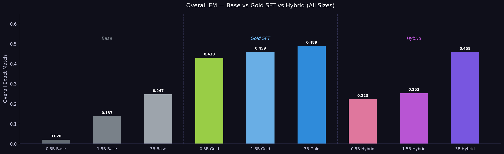

---

### Exact Match by Hop — All Models

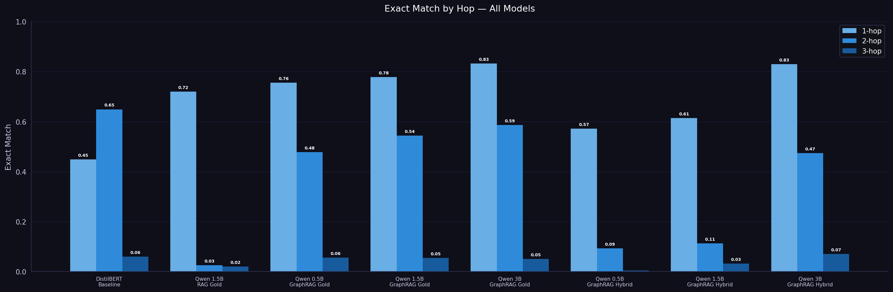

---

### F1 Score by Hop — All Models

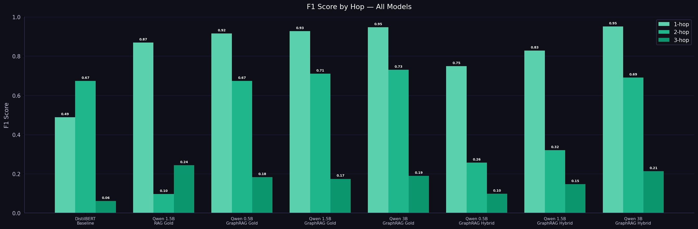

---

### Inference Latency — All Models

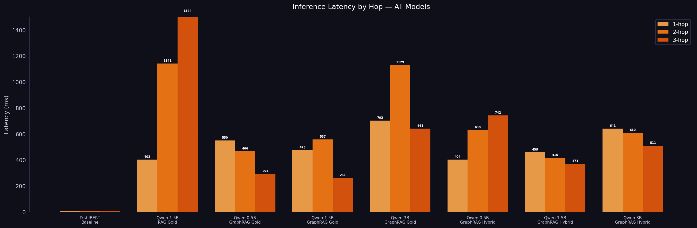

---

### GraphRAG Gold — Model Size Scaling

#### Exact Match by Hop

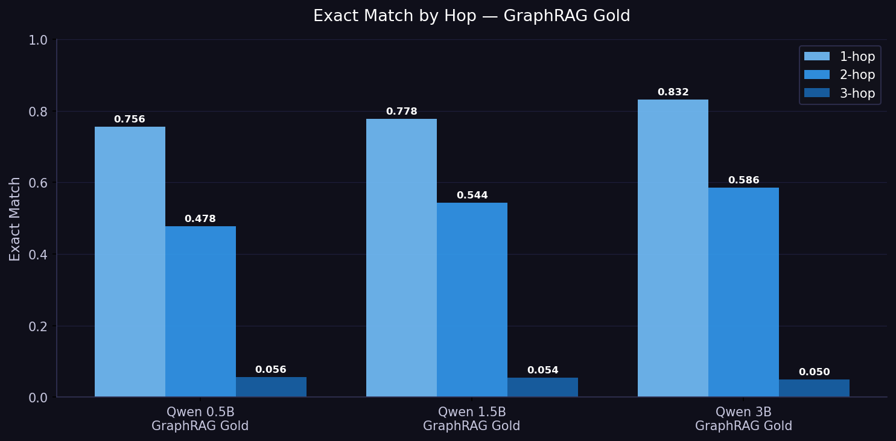

#### F1 Score by Hop

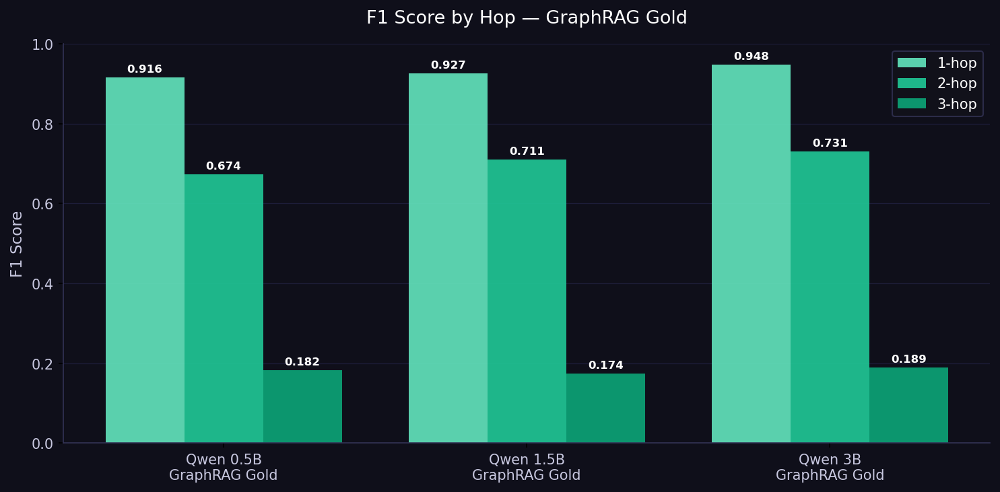

#### Overall Exact Match

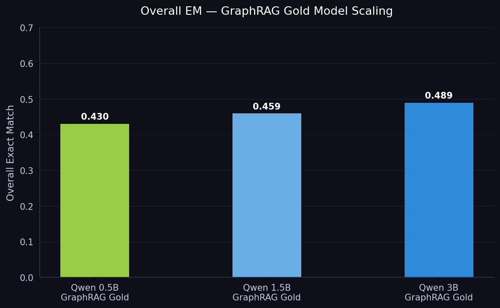

#### Inference Latency

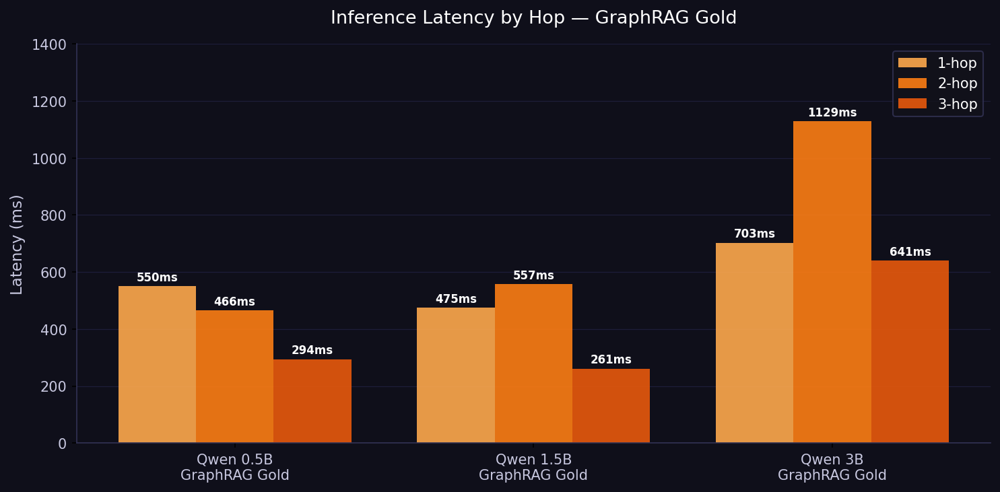

---

### Base Model vs Fine-tuned — Impact of Training

#### Exact Match Comparison

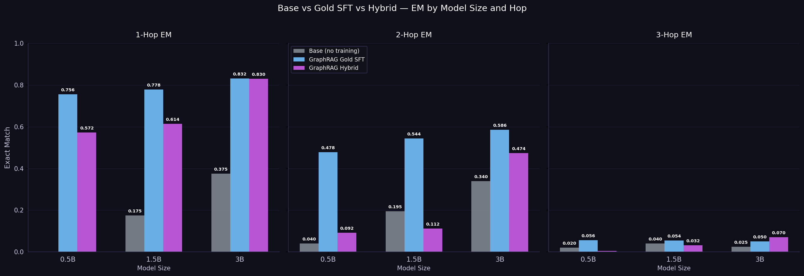

#### EM Improvement Over Base (delta)

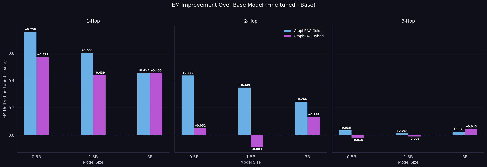

#### F1 Score Comparison

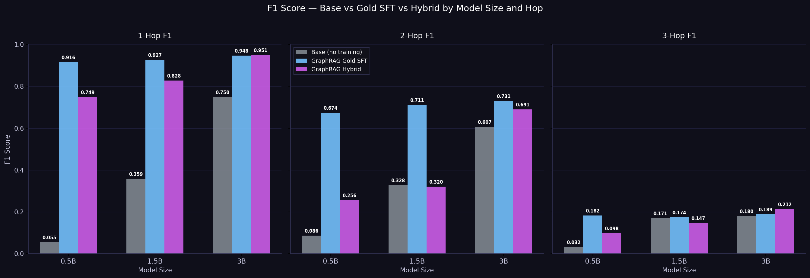

#### F1 Improvement Over Base (delta)

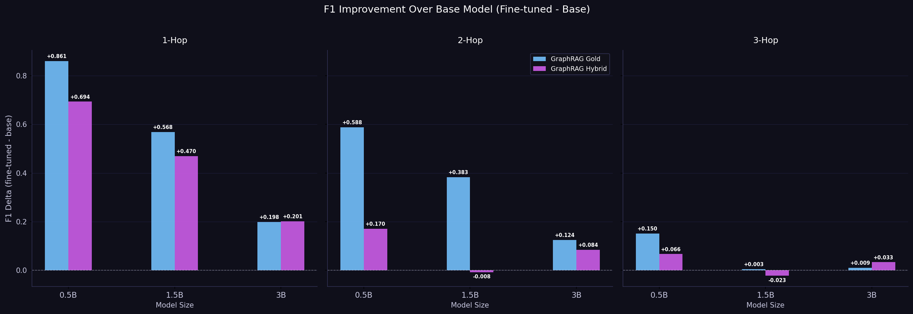

#### Latency Comparison

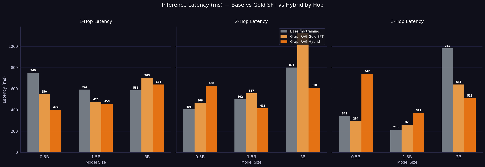

---

### Training Loss Curves

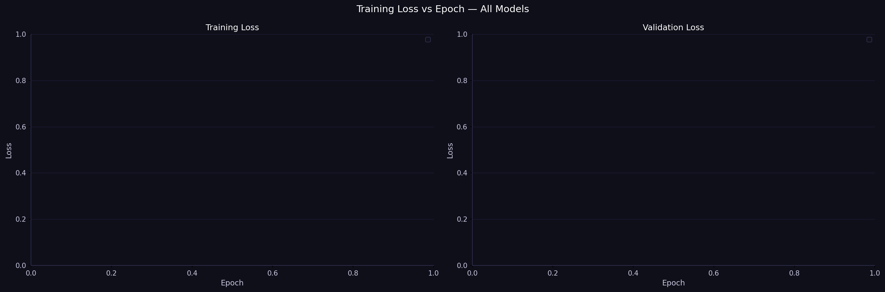

---

## Pipeline

```
Question with [bracketed entity]
        │
        ▼
Entity Extraction
        │
   ┌────┴────┐
   ▼         ▼
KG Traversal  FAISS Retrieval
(N-hop)      (top-K chunks)
   │         │
   └────┬────┘
        ▼
  Context Prompt
  (graph triples + retrieved text)
        │
        ▼
  Qwen2.5 Student (LoRA fine-tuned)
        │
        ▼
    Answer
```

**Example:**
```
Question: who directed [Inception]

Knowledge Graph triples:
  Inception -> directed_by -> Christopher Nolan
  Inception -> starred_actors -> Leonardo DiCaprio

Retrieved Context:
  - Inception directed_by Christopher Nolan

Answer: Christopher Nolan
```

---

## Dataset

**MetaQA** — Movie knowledge graph QA benchmark

| Split | 1-hop | 2-hop | 3-hop |
|-------|-------|-------|-------|
| Train | 96,106 | 118,980 | 114,196 |
| Dev | 9,992 | 14,872 | 14,274 |
| Test | 9,947 | 14,872 | 14,274 |

- KB: **134,741 triples** | **43,234 entities** | **9 relation types**
- Questions contain bracketed topic entities: `who directed [Inception]`
- Answers pipe-separated: `Christopher Nolan`
- Download: [Google Drive](https://drive.google.com/drive/folders/0B-36Uca2AvwhTWVFSUZqRXVtbUE)

---

## Repository Structure

```
pocket-graphrag/
├── app.py                              # Streamlit demo
├── run_all.py                          # Master training + evaluation script
├── results_charts.ipynb               # Jupyter notebook for all charts
├── dataset_info.json                   # LlamaFactory dataset registry
├── configs/
│   ├── lora_0.5b_graphrag_gold.yaml
│   ├── lora_0.5b_graphrag_hybrid.yaml
│   ├── lora_1.5b_graphrag_gold.yaml
│   ├── lora_1.5b_graphrag_hybrid.yaml
│   ├── lora_1.5b_rag_gold.yaml
│   ├── lora_3b_graphrag_gold.yaml
│   └── lora_3b_graphrag_hybrid.yaml
├── data/
│   ├── raw/                            # MetaQA (download separately)
│   ├── faiss/                          # Auto-generated by build_index.py
│   └── processed/instruction_pairs/   # Generated JSON datasets
├── checkpoints/                        # Saved model weights (not in git)
├── results/                            # Evaluation JSON + charts
└── src/
    ├── data/
    │   ├── load_kb.py
    │   ├── load_metaqa.py
    │   └── eda_inspect.py
    ├── graph/
    │   ├── entity_extract.py
    │   ├── subgraph.py
    │   └── serialize.py
    ├── retrieval/
    │   ├── embedder.py
    │   ├── faiss_index.py
    │   ├── build_index.py
    │   └── retrieve.py
    ├── models/
    │   └── baseline.py
    ├── teacher/
    │   └── build_instruction_set.py
    └── evaluation/
        ├── evaluate_student.py
        └── compile_results.py
```

---

## Quickstart

### 1. Environment setup

```bash
python -m venv .venv
source .venv/bin/activate          # Linux/Mac
# .venv\Scripts\Activate.ps1      # Windows

pip install "numpy<2" faiss-cpu==1.7.4
pip install transformers==4.35.0 datasets accelerate wandb peft
pip install sentence-transformers llamafactory openai streamlit pandas tqdm matplotlib
```

**PyTorch — choose for your GPU:**
```bash
# RTX 5070/5080/5090 (Blackwell sm_120)
pip install --pre torch torchvision torchaudio \
    --index-url https://download.pytorch.org/whl/nightly/cu128

# RTX 3090/4090/A6000
pip install torch==2.4.1 \
    --index-url https://download.pytorch.org/whl/cu124
```

### 2. Download MetaQA data

```
https://drive.google.com/drive/folders/0B-36Uca2AvwhTWVFSUZqRXVtbUE
```

Arrange as:
```
data/raw/kb.txt
data/raw/1hop/qa_train.txt  qa_dev.txt  qa_test.txt
data/raw/2hop/  (same structure)
data/raw/3hop/  (same structure)
```

> Rename folders from `1-hop` to `1hop` after download.

### 3. Build FAISS index (once)

```bash
python src/retrieval/build_index.py --kb_path data/raw/kb.txt
```

### 4. Build instruction datasets

```bash
# Gold GraphRAG — free, no API needed
python src/teacher/build_instruction_set.py \
    --mode graphrag --label_source gold \
    --samples_per_hop 2000 --seed 42 \
    --output_path data/processed/instruction_pairs/train_graphrag_gold.json

# Gold RAG — ablation baseline
python src/teacher/build_instruction_set.py \
    --mode rag --label_source gold \
    --samples_per_hop 2000 --seed 42 \
    --output_path data/processed/instruction_pairs/train_rag_gold.json

# Hybrid teacher evidence — DeepSeek (~$0.05 per 1500 examples)
export DEEPSEEK_API_KEY="your-key"
python src/teacher/build_instruction_set.py \
    --mode graphrag --label_source hybrid \
    --samples_per_hop 2000 --seed 42 \
    --teacher_provider deepseek \
    --teacher_model deepseek-chat \
    --output_path data/processed/instruction_pairs/train_graphrag_hybrid.json
```

Copy `dataset_info.json` to instruction pairs folder:
```bash
cp dataset_info.json data/processed/instruction_pairs/dataset_info.json
```

### 5. Train all models (runs overnight)

```bash
python run_all.py --experiments gold hybrid --sizes 0.5b 1.5b 3b
```

Or train individually:
```bash
llamafactory-cli train configs/lora_1.5b_graphrag_gold.yaml
```

### 6. Evaluate

```bash
python src/evaluation/evaluate_student.py \
    --model_path checkpoints/qwen2.5-3b-graphrag-gold \
    --mode graphrag \
    --run_name qwen2.5-3b-graphrag-gold \
    --n_samples 500
```

### 7. Compile results table

```bash
python src/evaluation/compile_results.py --save_csv results/comparison.csv
```

### 8. Generate charts

Open `results_charts.ipynb` in Jupyter and run all cells.

### 9. Run demo

```bash
streamlit run app.py
```

Opens at `http://localhost:8501` — side-by-side DistilBERT vs Qwen2.5 with graph triples and retrieved chunks visible.

---

## Training Configuration

| Parameter | 0.5B | 1.5B | 3B |
|-----------|------|------|----|
| `lora_rank` | 16 | 16 | 16 |
| `lora_alpha` | 32 | 32 | 32 |
| `per_device_train_batch_size` | 2 | 1 | 1 |
| `gradient_accumulation_steps` | 8 | 16 | 16 |
| `cutoff_len` | 512 | 512 | 512 |
| `num_train_epochs` | 3 | 3 | 3 |
| `learning_rate` | 2e-4 | 2e-4 | 2e-4 |
| `trainable params` | ~4M | ~4M | ~4M |

All models use `seed: 42` and `data_seed: 42` for reproducibility.

---

## Instruction Set Format

**Gold label** (free — MetaQA gold answer, no API):
```json
{
  "instruction": "Answer the question using the retrieved context and knowledge graph. Return only the answer entity or entities separated by |.",
  "input": "Knowledge Graph:\nInception -> directed_by -> Christopher Nolan\n\nRetrieved Context:\n- Inception directed_by Christopher Nolan\n\nQuestion: who directed Inception",
  "output": "Christopher Nolan"
}
```

**Hybrid label** (teacher evidence + gold answer):
```json
{
  "instruction": "Answer the question using the retrieved context and knowledge graph. First list the supporting evidence, then give the final answer.",
  "input": "Knowledge Graph:\nInception -> directed_by -> Christopher Nolan\n\nQuestion: who directed Inception",
  "output": "Supporting evidence:\n- Inception -> directed_by -> Christopher Nolan\n\nFinal answer: Christopher Nolan"
}
```

---

## Reproducibility

- All experiments use `--seed 42`
- Same seed + same MetaQA files = identical instruction pairs for all team members
- Training and test splits are completely separate — trained on `qa_train.txt`, evaluated on `qa_test.txt`
- LlamaFactory holds out 10% of instruction set as validation during training

> **Teacher API outputs are not deterministic.** Generate the hybrid dataset once and share the JSON file — do not call the API independently across team members.

---

## WandB Tracking

All training and evaluation runs are logged to:

```
https://wandb.ai/st125989-asian-institute-of-technology/pocket-graphrag
```

Login before running:
```bash
wandb login
```

---

## Troubleshooting

| Error | Cause | Fix |
|-------|-------|-----|
| `module 'inspect' has no attribute` | `inspect.py` shadows built-in | Rename `src/data/inspect.py` → `eda_inspect.py` |
| `faiss import error` | numpy 2.x incompatible | `pip install "numpy<2" faiss-cpu==1.7.4` |
| `CUDA out of memory` | Sequence too long | Set `cutoff_len: 384` in yaml |
| `dataset_info.json not found` | Wrong location | Copy to `data/processed/instruction_pairs/` |
| `UnicodeEncodeError: charmap` | Windows cp1252 encoding | Add `encoding='utf-8'` to all `open()` calls |
| RTX 5070 not compatible | Needs nightly for sm_120 | Use PyTorch nightly cu128 |
| `checkpoints/model is not a local folder` | Model not trained yet | Run `llamafactory-cli train` first |

---

## Team

Asian Institute of Technology

WandB: [pocket-graphrag](https://wandb.ai/st125989-asian-institute-of-technology/pocket-graphrag)
GitHub: [Samir4456/Prerequisite-Aware-GraphRAG-Distillation-for-Educational-QA](https://github.com/Samir4456/Prerequisite-Aware-GraphRAG-Distillation-for-Educational-QA)
